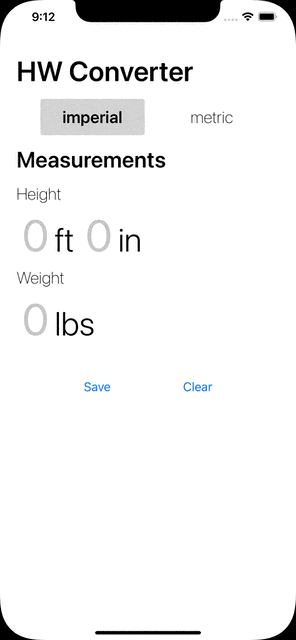

# Height/Weight Converter

## Instructions

0. Clone project
1. `yarn`
2. Pods should be installed already. If not, run `npx pod-install`
3. ios: `yarn ios`, android: `yarn android`
4. 💯% code coverage! To run tests: `yarn coverage`

## Features

### User

✅ Weight (numeric keyboard input)  
✅ Height (numeric keyboard input)  
✅ Units ("imperial (default)" and "metric" options)  
✅ Unit labels (lbs, ft, kg, m) are rendered to the right of the corresponding input fields.  
✅ When the units selection is changed, height and weight values are recalculated and unit labels are updated

### Dev

✅ Uses hooks like useReducer  
✅ Leverages localStorage  
✅ Built in TypeScript  
✅ 100% code coverage
